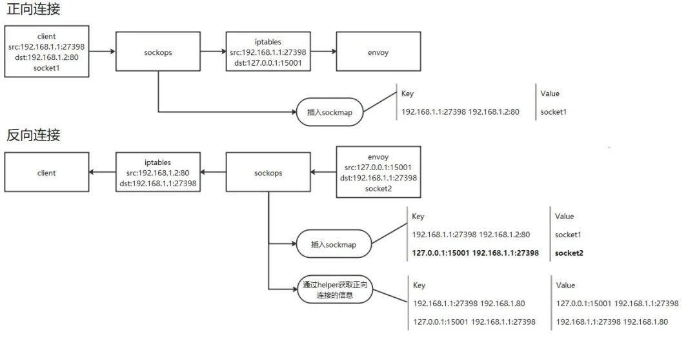

## Background Introduction

Early microservices architectures faced various challenges such as service discovery, load balancing, and authorization/authentication. Initially, practitioners of microservices implemented their own distributed communication systems to address these challenges. However, this approach resulted in redundant business functionality. To solve this problem, a solution was proposed: extracting the common distributed system communication code into a framework and providing it as a library for programmatic use. However, this seemingly perfect solution had several fatal weaknesses:

- The framework required invasive modifications to the business code, necessitating developers to learn how to use the framework.
- The framework could not be used across different programming languages.
- Managing compatibility issues with complex project frameworks and library versions was challenging, as upgrading the framework often forced businesses to upgrade as well.

As microservices architecture evolved, the first-generation service mesh emerged, represented by Linkeerd/Envoy/NginxMesh and the sidecar proxy pattern. As an infrastructure layer, the sidecar proxy is decoupled from the business processes and deployed alongside them. It takes over the communication between business components, abstracting the network data transmission into a separate layer. This layer centrally handles functions such as service discovery, load balancing, and authorization/authentication required by distributed systems, achieving reliable transmission of requests in the network topology. It provides a more comprehensive solution to the problems encountered with microservice framework libraries.

However, there is no silver bullet in software development. While service mesh brings many conveniences, it also inevitably presents some issues. In traditional approaches, messages between clients and servers only need to go through the kernel protocol stack once to complete the message delivery. In the sidecar proxy mode, however, the business traffic is typically intercepted using the iptables capability of the kernel, resulting in multiple passes through the kernel protocol stack for business data. This increases latency and reduces throughput.

We conducted benchmark tests on service mesh performance and found that the sidecar mode (with Envoy) had significantly worse latency compared to the non-sidecar mode (without Envoy).

## Accelerating ServiceMesh with eBPF Capabilities

Is there a way to reduce and eliminate the impact of network latency while enjoying the convenience provided by ServiceMesh? Here, we have to mention eBPF technology. eBPF is a revolutionary technology in the kernel that aims to extend the kernel's capabilities more securely and effectively without modifying the kernel code or loading kernel modules. By using eBPF capabilities to bypass the kernel network protocol stack, we can reduce network latency and improve the user experience of ServiceMesh. This is currently a common practice in the industry.

To achieve the goal of bypassing the kernel network protocol stack, we need to utilize two capabilities provided by eBPF: sockops and socket redirection.

- Sockops provides the ability to identify and store sockets (usually identified by a tuple of four elements) in a sockmap data structure when creating TCP connections.
- Socket redirection supports referencing sockets from the sockmap based on keys during the transmission of TCP data. When a match is found, the data can be directly forwarded to the corresponding socket.
- For sockets not found in the sockmap, the packets are sent through the kernel network protocol stack as usual.

By combining these capabilities, we can forward packets directly to the corresponding socket without going through the kernel network protocol stack, reducing the time spent in the kernel network protocol stack.

During the process of establishing a TCP socket connection, there are actually two connection establishment processes: forward connection and reverse connection. In general, iptables information is used to obtain the actual IP address and port number during the connection establishment of both forward and reverse connections. By calling bpf_get_sockopt, we can actively obtain the addresses transformed by iptables in the eBPF function. This allows us to establish an auxiliary map to store the corresponding relationships between forward and reverse connections. When performing socket redirection, we first look for the connection information of the peer from the auxiliary map. If the connection information is found successfully, we proceed with the socket forwarding action. The principle is shown in the following diagram:

We conducted actual tests on openEuler 21.03 to evaluate the acceleration achieved through sockmap capabilities. The test environment was openEuler-21.03 / 5.10.0-4.17.0.28.oe1.x86_64, and the network configuration was set as fortio-envoy-envoy:80-fortio_server:80.

Based on the test results, compared to not using ServiceMesh, the QPS was improved by approximately 18% and the average latency was reduced by 15% when utilizing sockmap acceleration.

## Can service mesh performance overhead be eliminated entirely?

However, despite the significant acceleration achieved with sockmap for ServiceMesh, there still remains a considerable gap compared to not using ServiceMesh. This is primarily due to the substantial latency overhead introduced by the current proxy architecture of the service mesh. To completely eliminate the performance impact introduced by the service mesh, it is crucial to optimize at the architectural level.

Kmesh is actively exploring new approaches at the data plane architecture level to address this challenge, and the industry has also made significant efforts in this regard. In upcoming articles, we will provide detailed insights into these initiatives and optimization measures.
