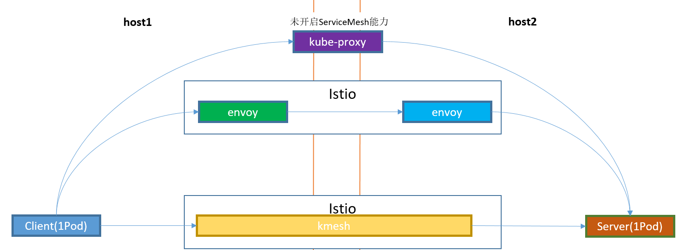
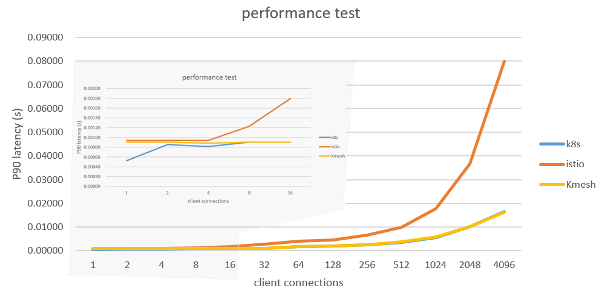

## Observability Integrations

Kmesh provides comprehensive monitoring capabilities through integration with industry-standard observability platforms:

- **Prometheus**: Collects and stores metrics for Kmesh performance and operations
- **Grafana**: Visualizes Kmesh metrics through customizable dashboards
- **Jaeger**: Enables distributed tracing to analyze service mesh traffic patterns

These integrations help monitor Kmesh's performance metrics, resource consumption, and traffic patterns in real-time.

## Test Networking



## Test Procedure

Kmesh uses `fortio` and `dstat` as performance test tools. `fortio` is a powerful microservice load test library that can collect statistics on latency and throughput information such as TP90, TP99, and QPS. `dstat` is a system information statistics tool. It is used to collect the CPU usage during the test.

### Test Method

Test a group of `fortio` performance data by using the number of concurrent connections as a variable parameter, and collect the CPU usage during the test. The [test script](https://github.com/kmesh-net/kmesh/test/performance/) has been archived.

## Test Execution

```shell
# Preparing the test environment
./fortio_perf.sh

# Generate a CSV table of test results in the directory.
ll
-rw-r--r--. 1 root root 6.1K Nov 5 17:39 fortio_perf_test.csv
```

## Performance


