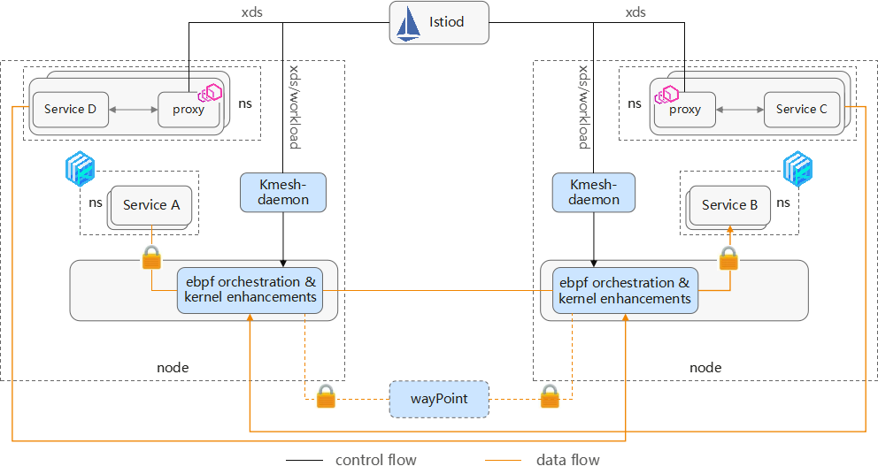

## 概述

阿里云服务网格（ASM）支持边车模式和无边车模式。边车模式中，每个服务实例旁边运行一个代理，这种模式目前是最常选且较为稳定的解决方案。然而，这种架构会引入延迟和资源开销。为了解决边车模式中固有的延迟和资源消耗问题，近年来出现了各种无边车模式的解决方案，例如 Istio Ambient。Istio Ambient 在每个节点上部署 ztunnel 对节点上运行的 Pod 进行 L4 流量代理，并部署 waypoint 来处理 L7 流量代理。虽然无边车模式可以降低延迟和资源消耗，但其稳定性和功能完整性仍有待提高。

<!-- truncate -->

ASM 目前支持多种无边车模式，例如 Istio Ambient 模式、ACMG 模式以及 Kmesh 等。Kmesh（详细信息请参见 [https://kmesh.net/](https://kmesh.net/)）是一款基于 eBPF 和可编程内核实现的高性能服务网格数据面软件。通过将流量管理卸载到内核中，Kmesh 使得网格内服务间的通信无需经过代理软件，从而显著缩短流量转发路径，并有效提升服务访问的转发性能。

### Kmesh 简介

Kmesh 的双引擎模式使用 eBPF 在内核空间截获流量，同时部署 Waypoint 代理来处理复杂的 L7 流量管理，从而实现内核空间（eBPF）和用户空间（Waypoint）间的 L4 与 L7 分离治理。与 Istio Ambient Mesh 相比，它降低了约 30% 的延迟；与内核原生模式相比，双引擎模式不需要内核增强，具有更广泛的适用性。



目前，ASM 支持将 Kmesh 的双引擎模式作为服务网格的数据面之一，从而实现更高效的服务管理。具体来说，ASM 可作为控制面使用，而 Kmesh 则可作为数据面部署在阿里云容器服务 Kubernetes（ACK）集群中。

## 在 ACK 中部署 Kmesh 并连接到 ASM

### 前提条件

首先需要创建一个 ASM 集群，并将 ACK 集群添加到 ASM 集群中进行管理。详细步骤请参阅文档：[将集群添加到 ASM 实例](https://www.alibabacloud.com/help/en/asm/getting-started/add-a-cluster-to-an-asm-instance-1?spm=a2c63.l28256.help-menu-search-147365.d_0)。

### 安装 Kmesh

运行以下命令将 Kmesh 项目克隆到本地。

```shell
git clone https://github.com/kmesh-net/kmesh.git && cd kmesh
```

#### 检查 ASM 控制面的服务

下载 Kmesh 后，首先需要执行以下命令以检查集群中当前 ASM 控制面的服务名称，从而配置 Kmesh 与 ASM 控制面之间的连接。

```shell
kubectl get svc -n istio-system | grep istiod

# istiod-1-22-6   ClusterIP   None   <none>   15012/TCP   2d
```

#### 使用 Kubectl 安装 Kmesh

你可以使用 kubectl 或 helm 在 ACK Kubernetes 集群中安装 Kmesh。但在安装前，请将 `ClusterId` 和 `xdsAddress` 环境变量添加到 Kmesh 的 DaemonSet 中。这些变量用于 Kmesh 与 ASM 控制面之间的身份验证和连接。ClusterId 为 Kmesh 部署所在 ACK 集群的 ID，而 xdsAddress 为 ASM 控制面的服务地址。

```yaml
# 你可以在以下文件中找到资源定义：
# helm: deploy/charts/kmesh-helm/templates/daemonset.yaml
# kubectl: deploy/yaml/kmesh.yaml
apiVersion: apps/v1
kind: DaemonSet
metadata:
  name: kmesh
  labels:
    app: kmesh
  namespace: kmesh-system
spec:
  template:
    spec:
      containers:
        - env:
          # ASM 控制面服务
          - name: XDS_ADDRESS
            value: "istiod-1-22-6.istio-system.svc:15012"
          # 添加 ACK 集群 ID
          - name: CLUSTER_ID
            value: "cluster-id"
    ...
```

完成修改后，可运行以下命令安装 Kmesh。

```shell
# 使用 kubectl 安装
kubectl apply -f deploy/yaml

# 使用 helm 安装
helm install kmesh deploy/charts/kmesh-helm -n kmesh-system --create-namespace
```

### 检查 Kmesh 启动状态

安装完成后，运行以下命令检查 Kmesh 的启动状态。

```shell
kubectl get pods -A | grep kmesh

# kmesh-system   kmesh-l5z2j   1/1   Running   0    117m
```

运行以下命令查看 Kmesh 运行状态。

```shell
kubectl logs -f -n kmesh-system kmesh-l5z2j

# time="2024-02-19T10:16:52Z" level=info msg="service node sidecar~192.168.11.53~kmesh-system.kmesh-system~kmesh-system.svc.cluster.local connect to discovery address istiod.istio-system.svc:15012" subsys=controller/envoy
# time="2024-02-19T10:16:52Z" level=info msg="options InitDaemonConfig successful" subsys=manager
# time="2024-02-19T10:16:53Z" level=info msg="bpf Start successful" subsys=manager
# time="2024-02-19T10:16:53Z" level=info msg="controller Start successful" subsys=manager
# time="2024-02-19T10:16:53Z" level=info msg="command StartServer successful" subsys=manager
# time="2024-02-19T10:16:53Z" level=info msg="start write CNI config\n" subsys="cni installer"
# time="2024-02-19T10:16:53Z" level=info msg="kmesh cni use chained\n" subsys="cni installer"
# time="2024-02-19T10:16:54Z" level=info msg="Copied /usr/bin/kmesh-cni to /opt/cni/bin." subsys="cni installer"
# time="2024-02-19T10:16:54Z" level=info msg="kubeconfig either does not exist or is out of date, writing a new one" subsys="cni installer"
# time="2024-02-19T10:16:54Z" level=info msg="wrote kubeconfig file /etc/cni/net.d/kmesh-cni-kubeconfig" subsys="cni installer"
# time="2024-02-19T10:16:54Z" level=info msg="command Start cni successful" subsys=manager
```

你可以通过以下命令为特定命名空间启用 Kmesh。

```shell
kubectl label namespace default istio.io/dataplane-mode=Kmesh
```

## 流量切换演示

### 部署示例应用及流量切换规则

在为默认命名空间启用 Kmesh 后，运行以下命令安装示例应用。

```shell
kubectl apply -f samples/fortio/fortio-route.yaml
kubectl apply -f samples/fortio/netutils.yaml
```

运行以下命令检查示例应用的运行状态。

```shell
kubectl get pod
# NAME                         READY   STATUS    RESTARTS   AGE
# fortio-v1-596b55cb8b-sfktr   1/1     Running   0          57m
# fortio-v2-76997f99f4-qjsmd   1/1     Running   0          57m
# netutils-575f5c569-lr98z     1/1     Running   0          67m

kubectl describe pod netutils-575f5c569-lr98z | grep Annotations
# Annotations:      kmesh.net/redirection: enabled
```

Pod 的标签 `kmesh.net/redirection: enabled` 表示该 Pod 已启用 Kmesh 转发功能。

运行以下命令查看当前定义的流量路由规则。从输出中可以看出，90% 的流量被导向 fortio 的 v1 版本，而 10% 的流量被导向 v2 版本。

```shell
kubectl get virtualservices -o yaml

# apiVersion: v1
# items:
# - apiVersion: networking.istio.io/v1beta1
#   kind: VirtualService
#   metadata:
#     annotations:
#       kubectl.kubernetes.io/last-applied-configuration: |
#         {"apiVersion":"networking.istio.io/v1alpha3","kind":"VirtualService","metadata":{"annotations":{},"name":"fortio","namespace":"default"},"spec":{"hosts":["fortio"],"http":[{"route":[{"destination":{"host":"fortio","subset":"v1"},"weight":90},{"destination":{"host":"fortio","subset":"v2"},"weight":10}]}]}}
#     creationTimestamp: "2024-07-09T09:00:36Z"
#     generation: 1
#     name: fortio
#     namespace: default
#     resourceVersion: "11166"
#     uid: 0a07f283-ac26-4d86-b3bd-ce6aa07dc628
#   spec:
#     hosts:
#     - fortio
#     http:
#     - route:
#       - destination:
#           host: fortio
#           subset: v1
#         weight: 90
#       - destination:
#           host: fortio
#           subset: v2
#         weight: 10
# kind: List
# metadata:
#   resourceVersion: ""
```

### 为 Fortio 服务部署 Waypoint

你可以在默认命名空间中执行以下命令部署 Waypoint，以处理服务级别的 L7 流量。

```shell
kubectl apply -f - <<EOF
apiVersion: gateway.networking.k8s.io/v1
kind: Gateway
metadata:
  labels:
    istio.io/waypoint-for: service
  name: fortio-waypoint
  namespace: default
spec:
  gatewayClassName: istio-waypoint
  listeners:
  - name: mesh
    port: 15008
    protocol: HBONE
EOF
```

接着，为 fortio 服务启用 Waypoint。

```shell
kubectl label service fortio istio.io/use-waypoint=fortio-waypoint
```

运行以下命令检查当前 Waypoint 的状态。

```shell
kubectl get gateway.gateway.networking.k8s.io

# NAME              CLASS            ADDRESS          PROGRAMMED   AGE
# fortio-waypoint   istio-waypoint   192.168.227.95   True         8m37s
```

### 开始测试流量

你可以通过执行以下命令启动测试流量。结果应显示约 10% 的流量被导向 fortio 的 v2 版本。

```shell
for i in {1..20}; do kubectl exec -it $(kubectl get pod | grep netutils | awk '{print $1}') -- curl -v $(kubectl get svc -owide | grep fortio | awk '{print $3}'):80 | grep "Server:"; done

# < Server: 1
# < Server: 1
# < Server: 1
# < Server: 1
# < Server: 1
# < Server: 1
# < Server: 1
# < Server: 1
# < Server: 2
# < Server: 1
# < Server: 1
# < Server: 1
# < Server: 1
# < Server: 1
# < Server: 1
# < Server: 1
# < Server: 1
# < Server: 2
# < Server: 1
# < Server: 1
```
