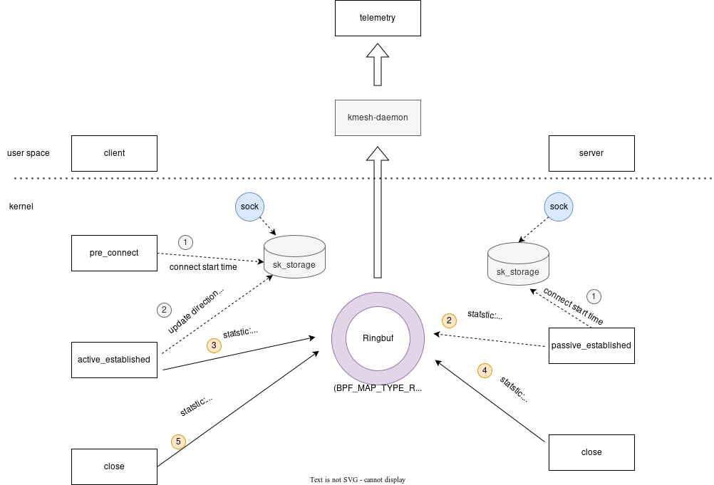

## 引言

Kmesh 是一个内核原生、无边车(sidecarless) 的服务网格数据平面。借助 `ebpf` 和可编程内核，它将流量治理下沉到操作系统内核，从而减少了服务网格的资源开销和网络延迟。

内核中可以直接获取流量数据，并通过 `bpf map` 将数据传递到用户态。这些数据用于构建指标和访问日志。

<!-- truncate -->

## 如何获取数据

在内核中，可以直接从 socket 中获取携带的指标数据。

bpf_tcp_sock 中携带的数据如下：

```c
struct bpf_tcp_sock {
	__u32 snd_cwnd;		/* 发送拥塞窗口 */
	__u32 srtt_us;		/* 平滑往返时延（左移 3 位，以微秒为单位） */
	__u32 rtt_min;
	__u32 snd_ssthresh;	/* 慢启动阈值 */
	__u32 rcv_nxt;		/* 下一个期望接收的数据 */
	__u32 snd_nxt;		/* 下一个将要发送的序列号 */
	__u32 snd_una;		/* 第一个等待确认的字节 */
	__u32 mss_cache;	/* 缓存的有效 MSS，不包括 SACKS */
	__u32 ecn_flags;	/* ECN 状态位 */
	__u32 rate_delivered;	/* 保存的速率采样：已交付的包数量 */
	__u32 rate_interval_us;	/* 保存的速率采样：经过的时间（微秒） */
	__u32 packets_out;	/* 正在“飞行”中的包 */
	__u32 retrans_out;	/* 重传的包 */
	__u32 total_retrans;	/* 整个连接的重传总数 */
	__u32 segs_in;		/* RFC4898 tcpEStatsPerfSegsIn：接收的总段数 */
	__u32 data_segs_in;	/* RFC4898 tcpEStatsPerfDataSegsIn：接收的数据段总数 */
	__u32 segs_out;		/* RFC4898 tcpEStatsPerfSegsOut：发送的总段数 */
	__u32 data_segs_out;	/* RFC4898 tcpEStatsPerfDataSegsOut：发送的数据段总数 */
	__u32 lost_out;		/* 丢失的包 */
	__u32 sacked_out;	/* 被 SACK 确认的包 */
	__u64 bytes_received;	/* RFC4898 tcpEStatsAppHCThruOctetsReceived：累计接收（或确认）的字节数 */
	__u64 bytes_acked;	/* RFC4898 tcpEStatsAppHCThruOctetsAcked：累计确认的字节数 */
	__u32 dsack_dups;	/* RFC4898 tcpEStatsStackDSACKDups：接收到的 DSACK 块数 */
	__u32 delivered;	/* 包括重传在内的数据包总交付数 */
	__u32 delivered_ce;	/* 同上，但仅限 ECE 标记的数据包 */
	__u32 icsk_retransmits;	/* 未恢复（RTO）超时次数 */
};
```

**注意：** 上述数据并未全部用于构建指标和访问日志。Kmesh 后续会完善指标数据。目前使用的数据包括：

```c
struct tcp_probe_info {
    __u32 type;
    struct bpf_sock_tuple tuple;
    __u32 sent_bytes;
    __u32 received_bytes;
    __u32 conn_success;
    __u32 direction;
    __u64 duration; // 单位：纳秒
    __u64 close_ns;
    __u32 state; /* TCP 状态 */
    __u32 protocol;
    __u32 srtt_us; /* 平滑往返时延（左移 3 位，以微秒为单位） */
    __u32 rtt_min;
    __u32 mss_cache;     /* 缓存的有效 MSS，不包括 SACKS */
    __u32 total_retrans; /* 整个连接的重传总数 */
    __u32 segs_in;       /* RFC4898 tcpEStatsPerfSegsIn：接收的总段数 */
    __u32 segs_out;      /* RFC4898 tcpEStatsPerfSegsOut：发送的总段数 */
    __u32 lost_out;      /* 丢失的包 */
};
```

除了上述可直接访问的数据外，Kmesh 在链路建立期间还会临时记录数据，例如在链路关闭时获取链路时长等信息。

## 如何处理数据

当 Kmesh 完成对该链路数据的处理后，它会通过 ringbuf 将数据传递到用户态。

在用户态解析 ringbuf 中的数据后，Kmesh 根据链路的源和目的信息构建 `metricLabels`，然后更新 `metricController` 中的缓存。

这是因为通过 ringbuf 上报的数据是以 Pod 为粒度的链路数据，而呈现给用户的指标既有 Pod 级别也有服务级别，因此还需要进行聚合处理。

从目的工作负载的 `Services` 信息中获取集群内目的服务的主机名和命名空间：

```go
namespacedhost := ""
for k, portList := range dstWorkload.Services {
    for _, port := range portList.Ports {
        if port.TargetPort == uint32(dstPort) {
            namespacedhost = k
            break
        }
    }
    if namespacedhost != "" {
        break
    }
}
```

在构建了工作负载粒度和服务粒度的 metricLabels 后，缓存会被更新。

每 5 秒，指标信息会通过 Prometheus API 更新到 Prometheus 中。

在处理指标的同时，会生成与访问日志相关的数据。每当链路关闭时，系统会利用这些数据生成访问日志，并将其打印到 Kmesh 的日志中。

下图展示了架构图：



### 结果

当前阶段由 Kmesh L4 监控的指标如下：

**工作负载：**

| 名称                                         | 描述                                  |
| -------------------------------------------- | ------------------------------------- |
| kmesh_tcp_workload_connections_opened_total  | 打开到工作负载的 TCP 连接总数         |
| kmesh_tcp_workload_connections_closed_total  | 关闭到工作负载的 TCP 连接总数         |
| kmesh_tcp_workload_received_bytes_total      | 通过 TCP 连接从工作负载接收的总字节数 |
| kmesh_tcp_workload_sent_bytes_total          | 通过 TCP 连接向工作负载发送的总字节数 |
| kmesh_tcp_workload_conntections_failed_total | 连接工作负载失败的 TCP 连接总数       |

**服务：**

| 名称                                | 描述                              |
| ----------------------------------- | --------------------------------- |
| kmesh_tcp_connections_opened_total  | 打开到服务的 TCP 连接总数         |
| kmesh_tcp_connections_closed_total  | 关闭到服务的 TCP 连接总数         |
| kmesh_tcp_received_bytes_total      | 通过 TCP 连接从服务接收的总字节数 |
| kmesh_tcp_sent_bytes_total          | 通过 TCP 连接向服务发送的总字节数 |
| kmesh_tcp_conntections_failed_total | 连接服务失败的 TCP 连接总数       |

指标示例结果：

```sh
kmesh_tcp_workload_received_bytes_total{connection_security_policy="mutual_tls",destination_app="httpbin",destination_canonical_revision="v1",destination_canonical_service="httpbin",destination_cluster="Kubernetes",destination_pod_address="10.244.0.11",destination_pod_name="httpbin-5c5944c58c-v9mlk",destination_pod_namespace="default",destination_principal="-",destination_version="v1",destination_workload="httpbin",destination_workload_namespace="default",reporter="destination",request_protocol="tcp",response_flags="-",source_app="sleep",source_canonical_revision="latest",source_canonical_service="sleep",source_cluster="Kubernetes",source_principal="-",source_version="latest",source_workload="sleep",source_workload_namespace="default"} 231
```

这些指标也可以通过 Prometheus 仪表板进行查看。参见 [Kmesh 可观测性](/docs/transpot-layer/l4-metrics)

当前阶段由 Kmesh L4 监控的访问日志包括：

| 名称           | 描述                                                         |
| -------------- | ------------------------------------------------------------ |
| src.addr       | 请求的源地址和端口，发起请求的源工作负载                     |
| src.workload   | 发起请求的 Pod 名称                                          |
| src.namespace  | 源工作负载所在的命名空间                                     |
| dst.addr       | 请求的目的地址和端口，接收请求的目的工作负载                 |
| dst.service    | 目的服务的主机名                                             |
| dst.workload   | 接收请求的 Pod 名称                                          |
| dst.namespace  | 目的工作负载所在的命名空间                                   |
| direction      | 流量方向。 INBOUND 表示流入目的服务，OUTBOUND 表示流出源服务 |
| sent_bytes     | 该连接发送的字节数                                           |
| received_bytes | 该连接接收的字节数                                           |
| duration       | 该连接的持续时间                                             |

访问日志示例结果：

```sh
accesslog: 2024-09-14 08:19:26.552709932 +0000 UTC
src.addr=10.244.0.17:51842, src.workload=prometheus-5fb7f6f8d8-h9cts, src.namespace=istio-system,
dst.addr=10.244.0.13:9080, dst.service=productpage.echo-1-27855.svc.cluster.local, dst.workload=productpage-v1-8499c849b9-bz9t9, dst.namespace=echo-1-27855, direction=INBOUND, sent_bytes=5, received_bytes=292, duration=2.733902ms
```

## 总结

Kmesh 直接从 socket 中获取流量数据，并通过 ringbuf 将数据传递到用户态以生成 `Metric` 和 `Accesslog`，并将其暴露给 Prometheus。

这种方式避免了在用户态截取流量并以原生方式获取指标，同时通过定时批量更新用户态指标，避免在高流量时增加网络延迟。

后续，我们还将开发链路追踪功能，以补全 Kmesh 的可观测能力。

欢迎加入 [Kmesh 社区](https://github.com/kmesh-net/kmesh)!
