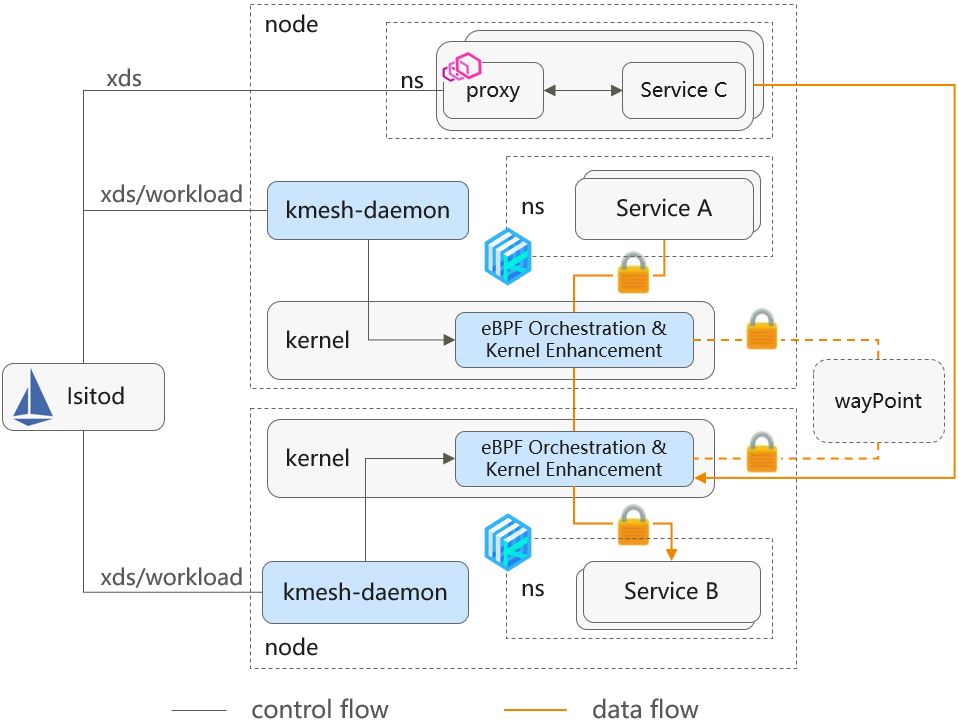
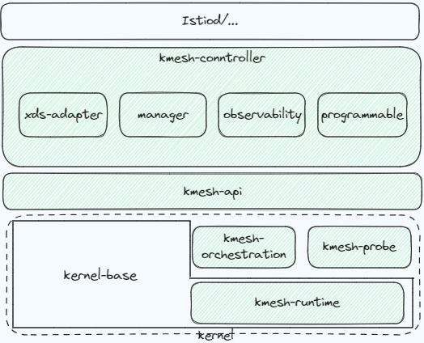
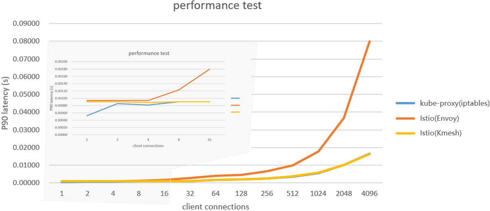
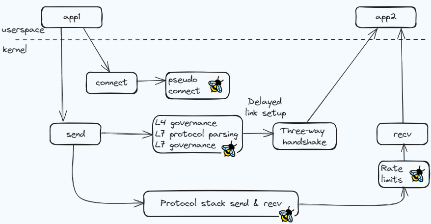
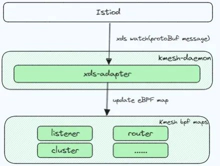
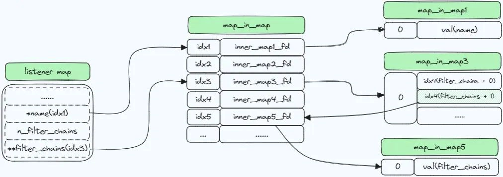

Kmesh 是一款全新的内核级流量管理引擎，通过基础软件创新帮助用户在云原生场景中构建高性能通信基础设施。用户可在服务网格环境中通过 helm 一键部署 Kmesh，与 Istiod 实现无缝连接。通过将流量管理下沉到操作系统，Kmesh 相比 Istio Sidecar 方案可降低超过 50% 的转发延迟，为应用提供极致的转发性能体验。

<!-- truncate -->

## Kmesh 简介

基于 eBPF 和可编程内核技术，Kmesh 将流量管理下沉到操作系统，消除了数据路径上代理层的需求，从而实现了内核级无 Sidecar 的网格数据平面。

### Kmesh 的关键能力

- **高性能：** 原生支持内核中 L4~L7 的流量管理功能，无需经过物理代理组件即可完成治理流程。这使得网格内服务通信路径由代理架构下的三跳降为一跳，显著提升了网格数据平面的转发性能。
- **低开销：** 无需在工作负载 Pod 附侧部署 Sidecar，大幅降低了网格基础设施的资源开销。
- **安全隔离：** 基于 eBPF 的运行时安全机制，支持 cgroup 级别的治理隔离。
- **无缝兼容：** 支持与遵循 xDS 协议的服务网格控制平面（如 Istiod）集成，同时也能与现有的 Sidecar 网格协同工作。  
  

Kmesh 的主要组件包括：

- **kmesh-controller：** 负责 BPF 生命周期管理、xDS 资源订阅、可观测性等功能。
- **kmesh-api：** 适配层，包含 xDS 转换后的编排 API、可观测性通道等。
- **kmesh-runtime：** 在内核中实现的运行时，支持 L4~L7 流量编排；第 7 层编排能力依赖于内核的增强。
- **kmesh-orchestration：** 基于 eBPF 实现 L4~L7 流量编排，如路由、金丝雀发布、负载均衡等。
- **kmesh-probe：** 提供端到端可观测性的探针工具。

## 性能测试

我们使用 fortio 在相同流量管理场景下测试了 Istio（Envoy）与 Istio(Kmesh) 的性能，同时以基于 kube-proxy(iptables) 的服务通信延迟作为基准参考。

**不同连接数下的延迟对比：**

**相同 QPS 下 CPU 开销对比：**

从测试结果中可以看出：

- Kmesh 的转发延迟几乎接近原生 Kubernetes 的转发延迟，明显优于 Istio Sidecar 模式。
- 在相同 QPS 下，Kmesh 的 CPU 开销基本与原生 Kubernetes 持平，相较于 Istio Sidecar 模式有大幅降低。

详细演示测试细节，请观看我们的演示视频：

  <iframe
    src=" https://youtube.com/embed/Sk39kNJIKZE"
    frameborder="0"
    allowfullscreen
  ></iframe>

## Kmesh 的关键技术解析

### 内核级流量编排运行时

在微服务通信中，通常在发送业务消息之前先建立连接。如果要对业务消息进行无缝编排，通常需要进行流量拦截，在完成编排后再根据拦截的内容进行消息转发。这是当前代理实现的方式。Kmesh 则旨在在流量传递过程中完成治理，并将连接建立延迟到业务消息发送阶段，以实现更高的编排处理性能。

#### 伪连接建立

在 pre_connect 过程中加载 BPF 程序。如果所访问的目标地址位于 xDS 监听器范围内，则调用 bpf_setsockopt，通过 TCP_ULP 将当前套接字的 TCP 协议钩子重新加载到 kmesh_defer 内核模块中。

#### 延迟连接建立

kmesh_defer 内核模块对 connect/send 钩子进行了重写（即对原生钩子的增强）：

- 当服务首次进入 connect 钩子时，会设置 bpf_defer_connect 标志，并不会触发握手过程。
- 在 send 钩子中，如果检测到套接字上设置了 bpf_defer_connect 标志，则触发 connect，此时通过扩展 BPF 程序调用 BPF_SOCK_OPS_TCP_DEFER_CONNECT_CB，完成流量治理后，再根据调整后的通信五元组和消息建立连接并发送数据。

整个治理过程大致如下图所示：

### xDS 规则管理

xDS 模型是一种分层树形规则表达，不同版本的模型定义可能有所调整。Kmesh 需要将模型信息转换为 eBPF map 存储，同时保持模型规则之间的层级关系。

#### 将 xDS 模型转换为 eBPF map 数据

**具体过程：**

1. Kmesh 订阅 Istiod 的 xDS 模型，并基于 protobuf-c 将 pb 模型转换为 C 数据结构风格。
2. 对于顶层模型（例如 listener），Kmesh 定义了对应的知名 map 表，其值的数据结构复用了 protobuf-c 导出的 C 结构体。
3. map 的更新从顶层模型的知名 map 表开始。对于记录中的指针成员，xds-adapter 会创建一个 inner-map 表，用于存储指针指向的实际数据区域；然后将 inner-map 的 map fd 添加到 map-in-map 表中，最终使用其在 map-in-map 表中的 key（索引）作为指针成员的值。

#### map-in-map 解决 xDS 模型的层级特性

对于 map 记录中的值成员，如果它们是指针变量（涉及引用其他数据结构），则通过 inner-map 存储所指向的数据区域：

- 如果值成员为基本数据类型（如 int），则可直接访问。
- 如果值成员为指针类型，则指针存储的值为 inner-map 中实际数据所在的索引（注：该索引与 kmesh-daemon 的 xds-adapter 模块在更新 bpf map 时协调写入）。在访问时，首先根据该索引查找 inner-map 的 map fd，然后从 inner-map 表中获取实际数据。对于多级指针成员，此过程会重复进行，直至所有指针信息被剥离。

### 流量管理编排实现

由于 xDS 的治理规则较为复杂，涉及层级匹配，其复杂度超出单个 eBPF 程序的处理能力。基于 eBPF Tail Calls 特性，Kmesh 将治理过程拆分为多个独立的 eBPF 程序，从而具备良好的可扩展性。

## Kmesh 最新关键特性

- **一键部署**  
  Kmesh 社区已发布 Kmesh 部署镜像，并支持通过 helm 一键部署 Kmesh。
- **基于命名空间的启用**  
  Kmesh 支持基于命名空间启用流量接管，例如：  
  `kubectl label namespace default label istio.io/dataplane-mode=Kmesh`
- **与 Istio Sidecar 的无缝集成**  
  对于集群中未启用 Kmesh 数据平面的命名空间，如使用 Sidecar 代理（例如 Envoy），Kmesh 同样支持互联。此外，可使用 sockmap 加速 Sidecar 的流量转发，带来 10% 至 15% 的转发性能提升，同时不影响业务流程。
- **与服务网格控制平面的自动集成**  
  Kmesh 支持与 Istiod 自动集成，理论上任何遵循 xDS 协议的网格控制平面均可与 Kmesh 集成。通过修改 yaml 中的 MESH_CONTROLLER 环境变量即可指定。
- **支持 xDS/工作负载**  
  Kmesh 支持 xDS 模型，实现 TCP 流量转发、HTTP/1.1 头匹配、路由及灰度发布，同时支持随机和轮询负载均衡算法。此外，还基于工作负载模型提供基本的转发功能。

## 展望未来

Kmesh 是一款基于 eBPF 和可编程内核实现的高性能流量管理引擎。与业内解决方案相比，它在转发性能上更高、资源开销更低。Kmesh 可在未打增强补丁的内核版本上以兼容模式运行，而对于完整的治理能力，目前 openEuler 23.03 版本已原生支持，其他操作系统则需基于增强补丁进行构建。  
Kmesh 正在逐步演进为更受欢迎的流量管理引擎，还有大量工作待完成。目前已计划支持将 L7 流量转发到 waypoint 以及 mTLS 功能。欢迎大家尝试 Kmesh，并与 Kmesh 社区保持联系。我们也非常期待您的参与。

## 在 KubeCon + CloudNativeCon Europe 2024 与 Kmesh 相见

在 KubeCon + CloudNativeCon Europe 2024 期间，Kmesh 将参与多项活动，包括：

### Kmesh 展台

**3 月 20 日至 22 日全天**  
欢迎前往 KubeCon 的 J1 展位，与专家交流或观看演示！

### Kmesh 开放演讲

**3 月 22 日（星期五），中欧时间 11:10-11:30**  
_内核原生流量治理框架带来全新性能体验_  

## 参考链接

[1] Kmesh 发布信息: https://github.com/kmesh-net/kmesh/releases

[2] Kmesh 部署镜像: https://github.com/orgs/kmesh-net/packages

[3] Kmesh 一键部署: https://github.com/kmesh-net/kmesh?tab=readme-ov-file#quick-start

[4] openEuler 23.03 版本: https://repo.openeuler.org/openEuler-23.03/

[5] 基于增强补丁的构建: https://github.com/kmesh-net/kmesh/blob/main/docs/kmesh_kernel_compile.md

[6] Kmesh 社区地址: https://github.com/kmesh-net/kmesh
