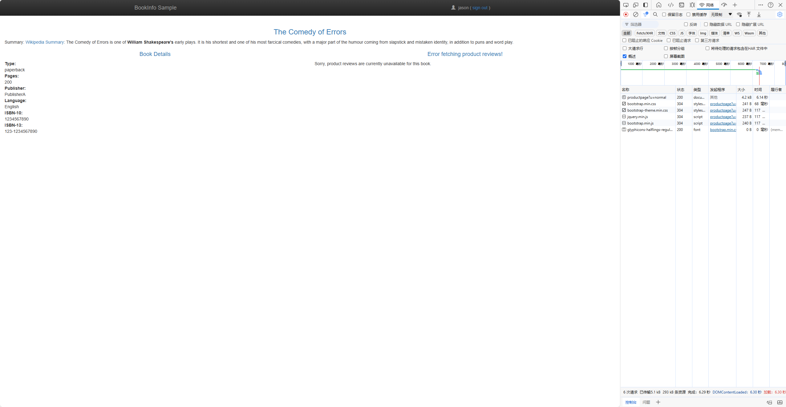
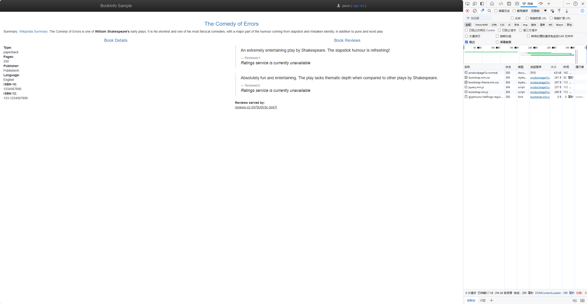

## 准备工作

1. 使默认命名空间由 Kmesh 管理

2. 部署 Bookinfo 作为示例应用程序，并部署 sleep 作为 curl 客户端

3. 为 reviews 服务安装服务粒度的 waypoint

   _以上步骤可以参考 [安装 Waypoint | Kmesh](/i18n/zh/docusaurus-plugin-content-docs/current/application-layer/install_waypoint.md#准备工作)_

4. 并为 ratings 服务安装 waypoint

   ```bash
   istioctl x waypoint apply -n default --name ratings-svc-waypoint
   kubectl label service ratings istio.io/use-waypoint=ratings-svc-waypoint
   kubectl annotate gateway ratings-svc-waypoint sidecar.istio.io/proxyImage=ghcr.io/kmesh-net/waypoint:latest
   ```

5. 通过运行以下命令应用应用程序版本路由：

   ```bash
   kubectl apply -f https://raw.githubusercontent.com/istio/istio/release-1.21/samples/bookinfo/networking/virtual-service-all-v1.yaml

   kubectl apply -f https://raw.githubusercontent.com/istio/istio/release-1.21/samples/bookinfo/networking/virtual-service-reviews-test-v2.yaml
   ```

- 在上述配置下，请求流如下：
  - `productpage` → `reviews:v2` → `ratings`（仅针对用户 `jason`）
  - `productpage` → `reviews:v1`（针对其他所有人）

## 注入 HTTP 延迟故障

为了测试 Bookinfo 应用程序微服务的弹性，为用户 `jason` 在 `reviews:v2` 和 `ratings` 微服务之间注入 7 秒的延迟。此测试将揭示 Bookinfo 应用程序中故意引入的一个错误。

**注意**：`reviews:v2` 服务对 `ratings` 服务的调用有一个 10 秒的硬编码连接超时。即使引入了 7 秒的延迟，您仍然期望端到端流程继续而不会出现任何错误。

1. 创建一个故障注入规则，以延迟来自测试用户 `jason` 的流量。

   ```bash
   kubectl apply -f - <<EOF
   apiVersion: networking.istio.io/v1alpha3
   kind: VirtualService
   metadata:
     name: ratings
   spec:
     hosts:
     - ratings
     http:
     - match:
       - headers:
           end-user:
             exact: jason
       fault:
         delay:
           percentage:
             value: 100.0
           fixedDelay: 7s
       route:
       - destination:
           host: ratings
           subset: v1
     - route:
       - destination:
           host: ratings
           subset: v1
   EOF
   ```

等待几秒钟，让新规则传播到所有 pod。

## 测试延迟配置

1. 在浏览器中打开 Bookinfo Web 应用程序。

2. 在 `/productpage` 网页上，以用户 `jason` 身份登录。

   您期望 Bookinfo 主页在大约 7 秒内加载而无错误。然而，存在一个问题：评论部分显示错误消息：

   `抱歉，此书的评论当前不可用。`

3. 查看网页响应时间：

   

## 了解发生了什么

正如预期的那样，您引入的 7 秒延迟不会影响 `reviews` 服务，因为 `reviews` 和 `ratings` 服务之间的超时硬编码为 10 秒。然而，`productpage` 和 `reviews` 服务之间也有一个硬编码的超时，编码为 3 秒 + 1 次重试，总共 6 秒。因此，`productpage` 对 `reviews` 的调用在 6 秒后过早超时并抛出错误。

在典型的企业应用程序中，不同团队独立开发不同微服务时，可能会出现此类错误。Istio 的故障注入规则帮助您识别此类异常，而不影响最终用户。

## 修复错误

您通常会通过以下方式修复问题：

1. 增加 `productpage` 到 `reviews` 服务的超时时间，或减少 `reviews` 到 `ratings` 的超时时间
2. 停止并重新启动修复后的微服务
3. 确认 `/productpage` 网页返回响应而无任何错误。

然而，您已经在 `reviews` 服务的 v3 版本中运行了一个修复。`reviews:v3` 服务将 `reviews` 到 `ratings` 的超时时间从 10 秒减少到 2.5 秒，以便与下游 `productpage` 请求的超时时间兼容（小于）。

如果您按照 [流量转移](https://kmesh.net/en/docs/userguide/try_traffic_shifting/) 任务中的描述将所有流量迁移到 `reviews:v3`，然后尝试将延迟规则更改为小于 2.5 秒的任何值，例如 2 秒，并确认端到端流程继续而无任何错误。

## 注入 HTTP 中止故障

测试微服务弹性的另一种方法是引入 HTTP 中止故障。在本任务中，您将为测试用户 `jason` 向 `ratings` 微服务引入 HTTP 中止。

在这种情况下，您期望页面立即加载并显示 `Ratings 服务当前不可用` 消息。

1. 创建一个故障注入规则，为用户 `jason` 发送 HTTP 中止：

   ```bash
   kubectl apply -f - <<EOF
   apiVersion: networking.istio.io/v1alpha3
   kind: VirtualService
   metadata:
     name: ratings
   spec:
     hosts:
     - ratings
     http:
     - match:
       - headers:
           end-user:
             exact: jason
       fault:
         abort:
           percentage:
             value: 100.0
           httpStatus: 500
       route:
       - destination:
           host: ratings
           subset: v1
     - route:
       - destination:
           host: ratings
           subset: v1
   EOF
   ```

## 测试中止配置

1. 在浏览器中打开 Bookinfo Web 应用程序。

2. 在 `/productpage` 上，以用户 `jason` 身份登录。

   如果规则成功传播到所有 pod，页面将立即加载并显示 `Ratings 服务当前不可用` 消息。

   

3. 如果您从用户 `jason` 注销或在匿名窗口（或另一个浏览器）中打开 Bookinfo 应用程序，您将看到 `/productpage` 仍然为除 `jason` 以外的所有人调用 `reviews:v1`（它根本不调用 `ratings`）。因此，您不会看到任何错误消息。

## 清理

1. 删除应用程序路由规则：

   ```bash
   kubectl delete virtualservice ratings
   ```

2. 如果您不打算探索任何后续任务，请参阅 [安装 Waypoint/清理](/i18n/zh/docusaurus-plugin-content-docs/current/application-layer/install_waypoint.md#清理) 说明以关闭应用程序。

## 演示

<div className="video-responsive">
  <iframe
    src="https://www.youtube.com/embed/tWgRaU_Zw8I"
    frameborder="0"
    allowfullscreen
  ></iframe>
</div>
