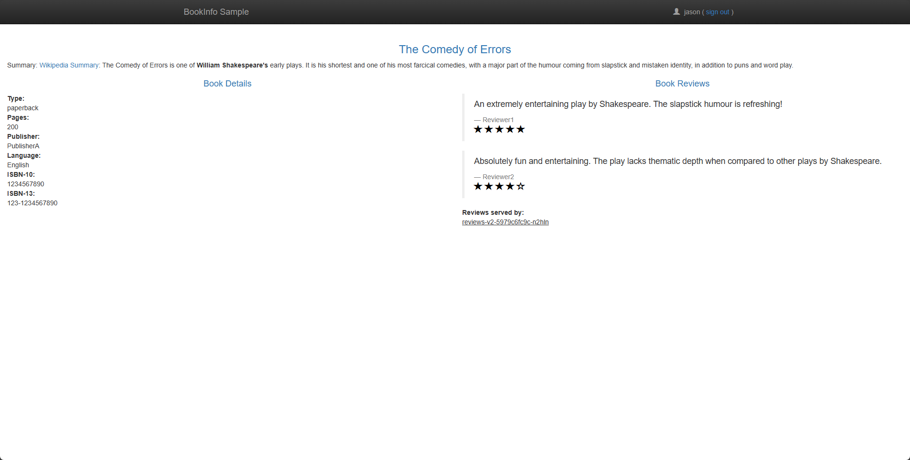
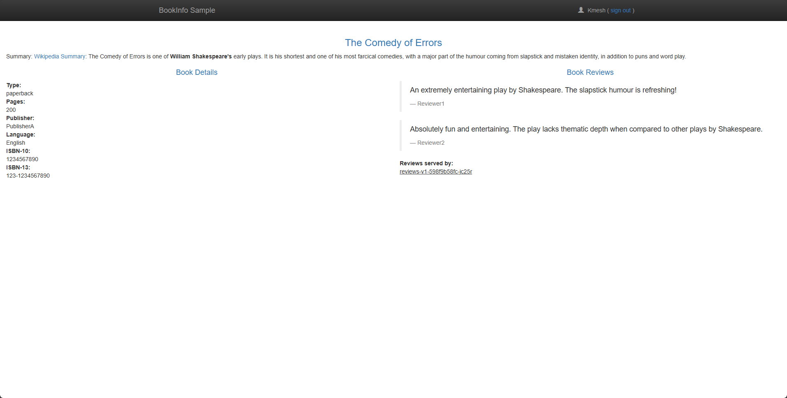

## 准备工作

1. 使默认命名空间由 Kmesh 管理
2. 部署 Bookinfo 作为示例应用程序，并部署 sleep 作为 curl 客户端
3. 为 reviews 服务安装服务粒度的 waypoint

   _以上步骤可以参考 [安装 Waypoint | Kmesh](/i18n/zh/docusaurus-plugin-content-docs/current/application-layer/install_waypoint.md#准备工作)_

## 应用基于版本的路由

1. 运行以下命令创建路由规则：

```bash
kubectl apply -f -<<EOF
apiVersion: networking.istio.io/v1alpha3
kind: VirtualService
metadata:
  name: reviews
spec:
  hosts:
    - reviews
  http:
  - route:
    - destination:
        host: reviews
        subset: v1
      weight: 100
---
apiVersion: networking.istio.io/v1alpha3
kind: DestinationRule
metadata:
  name: reviews
spec:
  host: reviews
  trafficPolicy:
    loadBalancer:
      simple: RANDOM
  subsets:
  - name: v1
    labels:
      version: v1
  - name: v2
    labels:
      version: v2
  - name: v3
    labels:
      version: v3
EOF
```

您已配置将发送到 `reviews` 服务的所有流量路由到 `v1` 版本。

2. 确认所有流量都流向 `reviews-v1`

```bash
kubectl exec deploy/sleep -- sh -c "for i in \$(seq 1 100); do curl -s http://productpage:9080/productpage | grep reviews-v.-; done"
```

3. 如果成功，输出应如下所示：

```bash
<u>reviews-v1-598f9b58fc-jc25r</u>
        <u>reviews-v1-598f9b58fc-jc25r</u>
        <u>reviews-v1-598f9b58fc-jc25r</u>
        <u>reviews-v1-598f9b58fc-jc25r</u>
        <u>reviews-v1-598f9b58fc-jc25r</u>
        <u>reviews-v1-598f9b58fc-jc25r</u>
        <u>reviews-v1-598f9b58fc-jc25r</u>
        <u>reviews-v1-598f9b58fc-jc25r</u>
        <u>reviews-v1-598f9b58fc-jc25r</u>
        ...
        <u>reviews-v1-598f9b58fc-jc25r</u>
        <u>reviews-v1-598f9b58fc-jc25r</u>
```

## 应用基于用户身份的路由

接下来，您将更改路由配置，以便来自特定用户的所有流量路由到特定的服务版本。在本例中，来自名为 Jason 的用户的所有流量将路由到服务 `reviews:v2`。

此示例得以实现，是因为 `productpage` 服务向发送到 reviews 服务的出站 HTTP 请求添加了自定义的 `end-user` 标头。

1. 运行以下命令启用基于用户的路由：

```bash
kubectl apply -f -<<EOF
apiVersion: networking.istio.io/v1alpha3
kind: VirtualService
metadata:
  name: reviews
spec:
  hosts:
    - reviews
  http:
  - match:
    - headers:
        end-user:
          exact: jason
    route:
    - destination:
        host: reviews
        subset: v2
  - route:
    - destination:
        host: reviews
        subset: v1
---
apiVersion: networking.istio.io/v1alpha3
kind: DestinationRule
metadata:
  name: reviews
spec:
  host: reviews
  trafficPolicy:
    loadBalancer:
      simple: RANDOM
  subsets:
  - name: v1
    labels:
      version: v1
  - name: v2
    labels:
      version: v2
  - name: v3
    labels:
      version: v3
EOF
```

2. 确认流量

   - 在 Bookinfo 应用程序的 `/productpage` 上，以用户 `jason` 身份登录。每个评论旁边都会显示星级评分。

   

   - 以其他用户身份登录。刷新浏览器。现在星星消失了。这是因为流量被路由到 `reviews:v1`（针对 Jason 以外的所有用户）。

   

## 了解发生了什么

在本任务中，您使用 Kmesh 将 100% 的流量发送到 `reviews` 服务的 `v1` 版本。然后，您覆盖规则，根据 `productpage` 服务添加到请求中的自定义 `end-user` 标头，有选择地将流量发送到 `reviews` 服务的 `v2` 版本。

## 清理

1. 删除应用程序路由规则：

```bash
kubectl delete virtualservice reviews
kubectl delete destinationrules reviews
```

2. 如果您不打算探索任何后续任务，请参阅 [安装 Waypoint/清理](/i18n/zh/docusaurus-plugin-content-docs/current/application-layer/install_waypoint.md#清理) 说明以移除 waypoint 并关闭应用程序。

## 演示

<div className="video-responsive">
  <iframe
    src="https://www.youtube.com/embed/FfKQbFogin4"
    frameborder="0"
    allowfullscreen
  ></iframe>
</div>