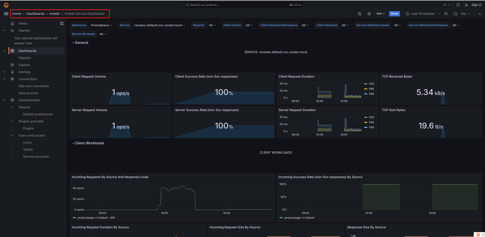

## 准备工作

1. 使 `default` 命名空间由 Kmesh 管理
2. 部署 `bookinfo` 作为示例应用程序，并部署 `sleep` 作为 curl 客户端
3. 为 `default` 命名空间安装命名空间粒度的 waypoint

   _上述步骤可参考 [安装 Waypoint | Kmesh](#)_

4. 部署 Prometheus 和 Grafana：

```bash
kubectl apply -f https://raw.githubusercontent.com/kmesh-net/kmesh/main/samples/addons/prometheus.yaml
kubectl apply -f https://raw.githubusercontent.com/kmesh-net/kmesh/main/samples/addons/grafana.yaml
```

---

## 在网格中的应用程序之间生成一些持续流量

```bash
kubectl exec deploy/sleep -- sh -c "while true; do curl -s http://productpage:9080/productpage | grep reviews-v.-; sleep 1; done"
```

---

## 使用 Grafana 可视化服务指标

1. 使用 port-forward 命令将流量转发到 Grafana：

```bash
kubectl port-forward --address 0.0.0.0 svc/grafana 3000:3000 -n kmesh-system
# Forwarding from 0.0.0.0:3000 -> 3000
```

2. 从浏览器查看仪表板

   访问 `Dashboards > Kmesh > Kmesh Service Dashboard`：

   

---

## 清理

1. 移除 Prometheus 和 Grafana：

```bash
kubectl delete -f https://raw.githubusercontent.com/kmesh-net/kmesh/main/samples/addons/prometheus.yaml
kubectl delete -f https://raw.githubusercontent.com/kmesh-net/kmesh/main/samples/addons/grafana.yaml
```

2. 如果您不打算探索任何后续任务，请参阅 [安装 Waypoint/清理](#) 说明以移除 waypoint 并关闭应用程序。

